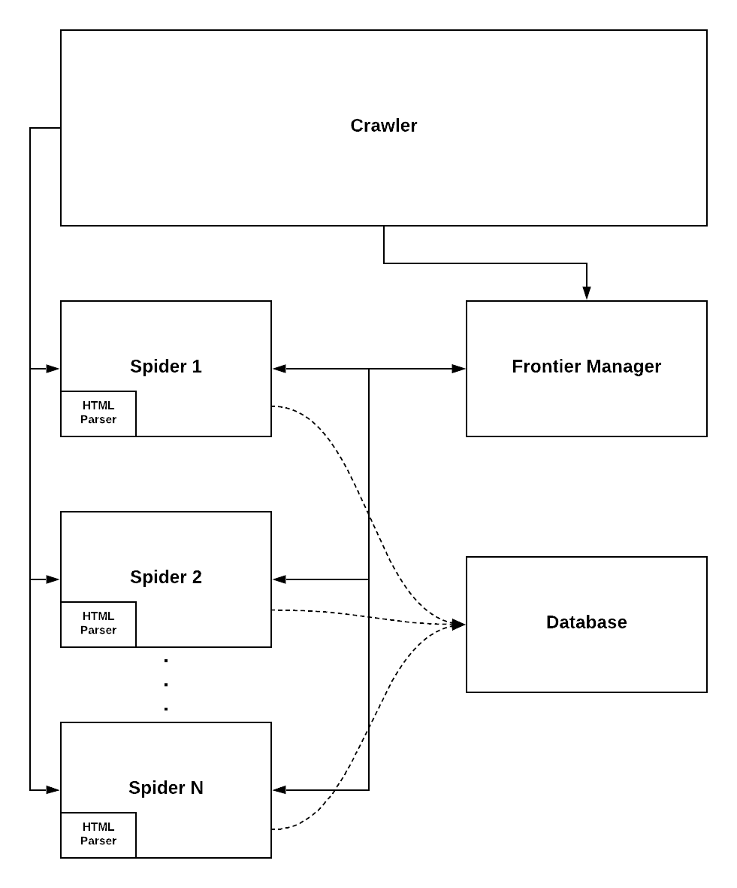

# IESPProject

 This is our implementation of a web crawler that crawls only  on **gov.si** web sites. When the program starts (see **Installation and use** below) **n** workers are
 created which begin crawling on the seed URLs in the frontier and use the breadth-first strategy. First each spider checks if it can crawl on the URL according to
 allow/disallow rules in the domains **robots.txt** file. Then we check if we already sent a request to this **IP address** if we did we sleep for 5 seconds or if a crawl
 delay exists we sleep for its value regardless. Then it adds all URLs from the domains site map if it exists and proceeds to send a get request to its working URL. After
 receiving the sites content, the spider parses it and writes all relevant data to the database and adds all links to the frontier. If a spider encounters an empty frontier
 it falls asleep for 60 seconds and checks if new links were added to the frontier every 10 seconds. If the frontier has received new links the spider wakes up and
 continues working, however if the frontier is empty for 60 seconds the spiders shuts down. The crawler consists of the following classes:

| Class | Description |
| ------ | ------ |
| Crawler | Master class that initializes the database, frontier manager and all spiders.  |
| Spider | Worker class that uses the breadth-first strategy.|
| HTMLParser | Pares relevant data from URL content (links, images, ...). |
| FrontierManager | Adds valid and non-duplicate URLs to the frontier.|
| Db | An interface for working with our database. |
| RobotFileParser | Parses each domain's robot.txt file. |



## Installation and use
We added a **requirements.txt** for easier installation. After cloning the repository go to the IESPProject folder and run the following command:
```
pip install -r requirements.txt
```

This should install all packages necessary for the crawler to run. After which run:
```
python main.py <number of workers>
```
The number of workers must be a positive integer!

Or simpy: 
```
python main.py
```

which will run the crawler with 5 workers.

TODO: Add instructions for database.

## Division of work
| Developer | Tasks |
| ------ | ------ |
| Yannick | Crawler implementation. |
| Mark | Database implementation and integration.|
| Rok | Data analysis, visualization and duplicate detection with  Locality-sensitive hashing.|
